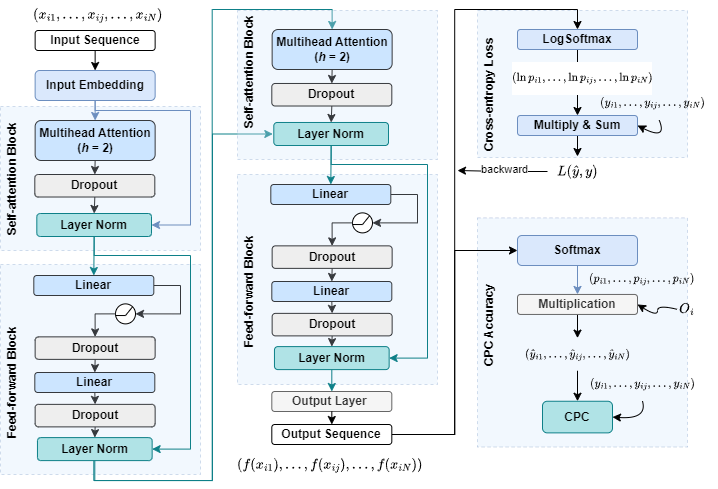

# TransformerGravity: a gravity-inspired deep learning framework for maritime traffic prediction in the global shipping network

## Table of Contents
0. [Overview](#overview)
1. [Architecture of *TransformerGravity*](#TG-architecture)
2. [Analytical Pipeline](#analytical-pipeline)
    - [Shipping network analysis](#shipping-network-analysis)
    - [Ship traffic flow prediction](#flow-prediction)
    - [Case study with ballast water risk assessment (BWRA)](#bwra-case-study)
3. [Running Notebook](#2)
    - [Setup](#2.1)
    - [Functional script](#2.2)
    - [Trained models](#2.3)
4. [Source Data](#3)
5. [Citation](#4)
6. [References](#5)

## 0. Overview

Maritime shipping traffic is a critical component of global trade, with significant implications for economic activities and environmental management. 
This project develops a novel physics-informed model, named ***TransformerGravity***, to forecast maritime shipping traffic between port regions worldwide. Inspired by the gravity model for mobility studies, our approach incorporates various factors that influence the likelihood and impact of vessel activities, such as shipping flux density, distance between ports, international trade flow, and centrality measures of transportation hubs.

Our model introduces transformers to the gravity model framework, enhancing the ability to capture both short- and long-term dependencies in maritime traffic data. This innovation enables us to achieve an 84.8% accuracy for forecasting the number of vessels flowing between key port areas, representing more than a 10% improvement over the DeepGravity model ([Simini et al., 2021]()) with MLPs sturcture and 50% improvement over traditional machine learning models.

In addition to its primary focus on shipping traffic flow prediction, the model's predicted information is also used as input for risk assessments related to the spread of non-indigenous species (NIS) through transportation networks. This application provides valuable insights for evaluating the capability of our solution in mitigating potential environmental impacts.

## 1. Framework of *TransformerGravity*

***TransformerGravity*** model is designed for vessel traffic flow prediction, incorporating stacked transformers and features from the gravity model (i.e., shipping fluxes at ports and distances between sources and destinations in the shipping network), international bilateral trade volume, and graph metrics of the shipping network. As illustrated in *Figure 1*, the process begins with input sequences that are embedded and passed through self-attention blocks with multi-head attention, dropout, and layer normalization. This is followed by feed-forward blocks containing linear layers and dropout, resulting in the output sequence. The model is trained using cross-entropy loss with log-softmax, and its performance is evaluated using the *Common Part of Commuters (CPC)* metric, which incorporates commuting patterns from the input data.

*Figure 1. Framework of the TransformerGravity model with two transformer encoder layers.*

Detailed explanations of the model structure, including layer-by-layer descriptions, evaluation metrics, and training configurations, can be found in the `Methods` section of our paper, *"Enhancing Global Maritime Traffic Network Forecasting with Gravity-Inspired Deep Learning Models"* [[arXiv](https://arxiv.org/abs/2401.13098)].

## 2. Analytical Pipeline

The whole analytical pipeline include three primary sections: (1) shipping network analysis, (2) vessel traffic flow prediction, and (3) a case study with ballast water risk assessment (BWRA), as illustrated in *Figure 2*.

*Figure 2. Experiment pipeline for analyzing and predicting links in the global shipping network, forecasting vessel traffic flows using gravity-informed models, and assessing environmental similarity for ballast water risk assessment in a case study.*

### Shipping network analysis

The analysis begins with the construction of a global shipping network (*Figure 3*) using vessel movement data from 2017-2019, derived from [et al., 2022]() and port information from the [World Port Index](). Centrality and PageRank graph metrics were then calculated as part of the feature set for vessel flow prediction. 
As disconnected and weakly connected components were detected, we fully connected the shipping network and performed link prediction to discriminate existing and non-existing shipping connections.

*Figure 3. Global shipping network 2017-2019.*

### Ship traffic flow prediction

### Case study with ballast water risk assessment (BWRA)

## 2. Running Notebook

### Setup

### 

## Soruce Data

## Citation